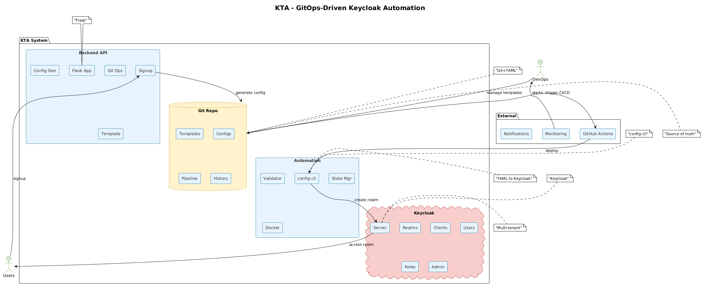

# kta - GitOps-Driven Keycloak Automation

**kta** is a comprehensive demonstration project that showcases how to implement fully automated, GitOps-driven Keycloak configuration management for multi-tenant SaaS applications using `keycloak-config-cli`.

##  Project Overview

This project demonstrates:

- **Configuration as Code**: Define complex Keycloak realm structures declaratively in YAML files
- **GitOps Workflow**: Use Git as the single source of truth for Keycloak configurations
- **Automated Tenant Onboarding**: Complete lifecycle automation for creating isolated tenant realms

- **Best Practices**: Consistency, auditability, and versioning of IAM infrastructure

## 🏗️ Architecture

The KTA system consists of four main components working together in a GitOps workflow.

### Workflow
1. **Tenant Signup** → API generates config from template
2. **Git Commit** → Configuration stored with version control
3. **CI/CD Trigger** → GitHub Actions deploys changes
4. **Keycloak Update** → Realm created/updated automatically

## Configuration

### Environment Variables

| Variable | Default | Description |
|----------|---------|-------------|
| `KEYCLOAK_URL` | `http://localhost:8080` | Keycloak server URL |
| `KEYCLOAK_ADMIN_USER` | `admin` | Keycloak admin username |
| `KEYCLOAK_ADMIN_PASSWORD` | `admin123` | Keycloak admin password |
| `KTA_BACKEND_PORT` | `5001` | Backend API port |

### Tenant Template

The tenant template (`keycloak-configs/_templates/tenant-template.yaml`) defines:

- **Realm Settings**: Security policies, token lifespans, internationalization
- **Clients**: Web application and API clients with OIDC configuration
- **Roles**: Hierarchical role structure (admin, manager, user, viewer)
- **Groups**: Organizational structure with role mappings
- **Users**: Initial tenant administrator with secure credentials
- **Authentication Flows**: Custom authentication workflows
- **Security Features**: Brute force protection, password policies

## 📚 Additional Resources

- [Keycloak Community](https://www.keycloak.org/community) for the excellent IAM platform
- [GitOps Working Group](https://github.com/gitops-working-group) for GitOps principles
- [Keycloak Documentation](https://www.keycloak.org/documentation)
- [keycloak-config-cli Documentation](https://github.com/adorsys/keycloak-config-cli)
- [GitOps Principles](https://www.gitops.tech/)

## License

This project is licensed under the MIT License - see the [LICENSE](LICENSE) file for details.

**Built with ❤️ for the DevOps and Identity Management community**

For questions, issues, or contributions, please visit our [GitHub repository](https://github.com/AssahBismarkabah/kta).
