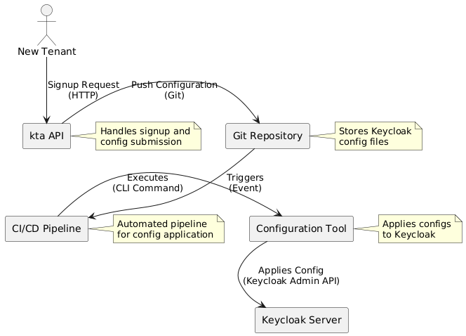

# GitOps-Driven Keycloak Automation Architecture

## Project Overview

**Kta** is a demonstration project that showcases how to implement a fully automated, GitOps-driven approach to managing Keycloak configurations for multi-tenant SaaS applications using `keycloak-config-cli`. The system enables automated tenant onboarding with isolated Keycloak realms while maintaining configuration as code principles.

## Key Objectives

- **Configuration as Code**: Define complex Keycloak realm structures declaratively in YAML files
- **GitOps Workflow**: Use Git as the single source of truth for Keycloak configurations
- **Automation**: Eliminate manual Keycloak administration through automated pipelines
- **Scalable Tenant Onboarding**: Automate the complete lifecycle of tenant realm creation
- **Best Practices**: Ensure consistency, auditability, and versioning of IAM infrastructure

## System Architecture

