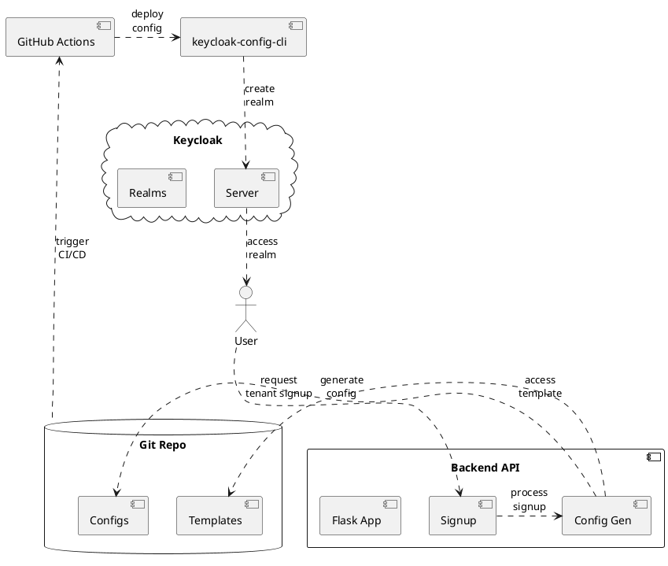
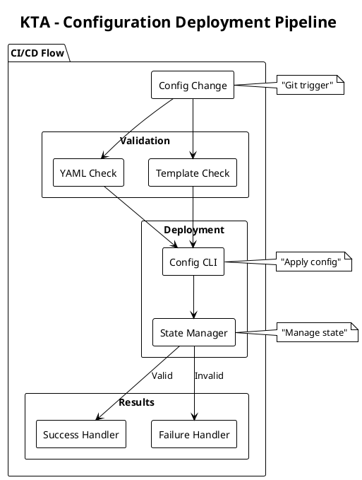

# Mastering Keycloak Configuration with GitOps and `keycloak-config-cli`: The KTA Project



Multi-tenant SaaS applications face a critical challenge: how do you efficiently and securely onboard hundreds or thousands of customers, each requiring their own isolated identity management space? Manual "Click-Ops" in Keycloak simply doesn't scale. Enter the **KTA (Keycloak Tenant Accelerator)** project—a comprehensive demonstration of how GitOps principles and the `keycloak-config-cli` tool can transform tenant onboarding from a manual bottleneck into a fully automated, auditable, and scalable process.

---

## 1. The Legacy Challenge: "Click-Ops" in Keycloak

Managing Keycloak manually is a common starting point, but it presents several challenges that grow with your application's scale:

-   **Lack of Versioning:** There is no easy way to track *who* changed *what* and *when*. Rolling back a problematic change is a difficult and error-prone process.
-   **Environment Inconsistency:** Replicating a configuration exactly from a development environment to a production environment is nearly impossible, leading to the dreaded "it works on my machine" syndrome.
-   **Scalability Issues:** Manually onboarding new tenants or services is a time-consuming, repetitive task that doesn't scale.


These problems highlight the need for a more systematic, automated, and auditable approach to managing Keycloak's configuration.

---

## 2. `keycloak-config-cli`: Your Key to Declarative Keycloak Management

This is where the open-source `adorsys/keycloak-config-cli` tool becomes essential. It's a Java-based command-line utility designed to manage Keycloak's configuration declaratively.

### Core Philosophy

The tool operates on a simple but powerful principle: **the state of your Keycloak realm should match the state defined in your configuration files.** You define everything—realms, clients, roles, users, authentication flows—in YAML or JSON files, and the CLI takes care of making the necessary API calls to Keycloak to make it so.

### Key Features:

-   **Idempotent Execution:** You can run the CLI with the same configuration file multiple times, and it will only apply changes if there's a drift between your file and the Keycloak state.
-   **Configuration as Code (CaC):** By storing your YAML/JSON files in Git, you get full versioning, peer reviews for changes (Pull Requests), and a complete audit history.
-   **Powerful Variable Substitution:** The tool allows you to use variables in your configuration files, making it perfect for creating reusable templates. It can substitute values from environment variables, property files, and more.
-   **No Restarts Needed:** Changes are applied live to Keycloak via its Admin API, meaning no downtime is required.


---

## 3. The KTA Project: Automated Tenant Onboarding at Scale

The **Keycloak Tenant Accelerator (KTA)** project demonstrates exactly how a real SaaS company can automate the complete lifecycle of tenant onboarding. Let's imagine a project management SaaS called "ConnectFlow" that needs to onboard companies like "Revolut" as isolated tenants.

### The Business Challenge

When any new tenant signs up for ConnectFlow's services, they need:
- Their own isolated identity realm (`{{TENANT_ID}}`)
- Secure web and API clients (`{{TENANT_ID}}-webapp`, `{{TENANT_ID}}-api`)
- Role-based access control (`tenant_admin`, `tenant_user`)
- Custom security policies and branding
- An initial administrator account to get started

Doing this manually for each new customer is unsustainable. The KTA project automates this entire process.

### Architecture Deep Dive: From Signup to Running Realm

The workflow demonstrated in the KTA project follows these steps:

1.  **Tenant Signup API:** A new tenant fills out a signup form, which hits the Flask backend at `/api/tenants/signup`
2.  **Configuration Generation:** The backend reads the master `tenant-template.yaml`, substitutes tenant-specific values, and generates `{{TENANT_ID}}.yaml`
3.  **GitOps Trigger:** The new configuration file is automatically committed and pushed to the Git repository
4.  **CI/CD Activation:** GitHub Actions detects the new file and triggers the deployment pipeline
5.  **Automated Deployment:** A containerized `keycloak-config-cli` applies the `{{TENANT_ID}}.yaml` configuration to the live Keycloak server
6.  **Instant Result:** The tenant's dedicated realm is created and ready for their team to use

This entire process takes minutes, not hours or days of manual configuration.


## 4. The Template-Driven Approach: Configuration as Code at Scale

The power of the KTA project lies in its template-driven approach to generating tenant configurations. Instead of manually creating each tenant's setup, everything starts with a master blueprint.

### KTA Project Structure


### The Master Template Blueprint

The master template (`_templates/tenant-template.yaml`) defines the complete structure of a Keycloak realm using placeholder variables:

*Template excerpt from `_templates/tenant-template.yaml`*:

```yaml
# Tenant Realm Template
realm: "{{TENANT_ID}}"
enabled: true
displayName: "{{TENANT_NAME}} Services"

# Security and Session Configuration
bruteForceProtected: true
accessTokenLifespan: 300  # 5 minutes
ssoSessionIdleTimeout: 1800  # 30 minutes
passwordPolicy: "length(8) and digits(1) and lowerCase(1) and upperCase(1) and specialChars(1)"

# Tenant Applications
clients:
  - clientId: "{{TENANT_ID}}-webapp"
    name: "{{TENANT_NAME}} Web Application"
    enabled: true
    publicClient: true
    redirectUris:
      - "https://{{TENANT_ID}}.kta.app/*"
      - "http://localhost:3000/*"  # For development
    
  - clientId: "{{TENANT_ID}}-api"
    name: "{{TENANT_NAME}} API Client" 
    enabled: true
    publicClient: false
    serviceAccountsEnabled: true
    secret: "{{TENANT_ID}}-api-secret-change-me"

# Role-Based Access Control
roles:
  realm:
    - name: "tenant_admin"
      description: "Administrator role for {{TENANT_NAME}} tenant"
    - name: "tenant_user"
      description: "Standard user role for {{TENANT_NAME}} tenant"

# Multi-tenant Protocol Mappers
protocolMappers:
  - name: "tenant-id-mapper"
    protocol: "openid-connect"
    protocolMapper: "oidc-hardcoded-claim-mapper"
    config:
      "claim.name": "tenant_id"
      "claim.value": "{{TENANT_ID}}"
      "access.token.claim": "true"
```

**How the Template System Works:**

1. **Master Template:** Contains placeholder variables like `{{TENANT_ID}}`, `{{TENANT_NAME}}`, and `{{ADMIN_PASSWORD}}`

2. **Flask Backend Processing:** When a signup request comes in, the backend:
   - Reads the master template
   - Substitutes variables with actual tenant values
   - Generates a complete, tenant-specific YAML file

3. **Result:** A fully configured realm blueprint ready for `keycloak-config-cli` to apply

### Template to Configuration Transformation

*When a tenant with ID "acme_corp" and name "ACME Corporation" signs up, the template becomes:*

```yaml
# Generated tenants/acme_corp.yaml
realm: "acme_corp"
displayName: "ACME Corporation Services"
clients:
  - clientId: "acme_corp-webapp"
    name: "ACME Corporation Web Application"
    redirectUris:
      - "https://acme_corp.kta.app/*"
protocolMappers:
  - config:
      "claim.value": "acme_corp"
```

### Multi-Tenancy in Action

Notice how every element is scoped to the specific tenant:
- **Realm isolation:** Each `{{TENANT_ID}}` realm is completely separate from other tenants
- **Custom applications:** `{{TENANT_ID}}-webapp` and `{{TENANT_ID}}-api` belong only to that tenant  
- **Tenant-aware tokens:** JWT tokens include `tenant_id: "{{TENANT_ID}}"` claims for application-level authorization
- **Security policies:** Each tenant can have their own password requirements and session timeouts

This level of isolation ensures that each tenant's users, applications, and data remain completely separate from other tenants on the same Keycloak serve.


## Demonstration Resources

To implement this solution in your environment, refer to these key resources:

1. **Setup and Installation**
   - [Keycloak Docker Setup Guide](https://www.keycloak.org/getting-started/getting-started-docker)
   - [GitHub Actions Self-Hosted Runner Documentation](https://docs.github.com/en/actions/hosting-your-own-runners/managing-self-hosted-runners/adding-self-hosted-runners)
   - [Keycloak Config CLI Repository](https://github.com/adorsys/keycloak-config-cli)

2. **Configuration Examples**
   - [Keycloak Realm Configuration Guide](https://www.keycloak.org/docs/latest/server_admin/#core-concepts-and-terms)
   - [GitHub Actions Workflow Examples](https://docs.github.com/en/actions/examples)
   - [Docker Compose Documentation](https://docs.docker.com/compose/)

3. **Additional Tools**
   - [PlantUML for Architecture Diagrams](https://plantuml.com/)
   - [YAML Validation Tools](https://yaml.org/spec/)
   - [Git Workflow Best Practices](https://git-scm.com/book/en/v2/Git-Branching-Branching-Workflows)

## CI/CD Pipeline: From Configuration to Deployment

Our GitHub Actions workflow automates the entire process from tenant configuration changes to deployment in Keycloak. This ensures consistency and reliability across all tenant deployments.

### The Pipeline in Detail:

- **Configuration Detection:**
  Monitors changes in `keycloak-configs/tenants/*.yaml` files to trigger the deployment process.
- **Validation Process:**
  Validates YAML syntax and tenant configuration structure before proceeding.
- **Deployment Orchestration:**
  Handles the configuration application through Keycloak Config CLI with proper error handling.



This automation yields powerful results, enabling seamless tenant management:

### Example Docker Compose for Local Testing

```yaml
services:
  keycloak:
    image: quay.io/keycloak/keycloak:26.1.2
    environment:
      KEYCLOAK_ADMIN: admin
      KEYCLOAK_ADMIN_PASSWORD: admin123
      KC_HTTP_PORT: 8080
      KC_HEALTH_ENABLED: 'true'
    ports:
      - "8080:8080"
    command:
      - start-dev
    healthcheck:
      test: ["CMD", "curl", "-f", "http://localhost:8080/health/ready"]
      interval: 10s
      timeout: 5s
      retries: 5

  config-cli:
    image: adorsys/keycloak-config-cli:latest
    depends_on:
      keycloak:
        condition: service_healthy
    volumes:
      - ./keycloak-configs:/config
    environment:
      KEYCLOAK_URL: http://keycloak:8080
      KEYCLOAK_USER: admin
      KEYCLOAK_PASSWORD: admin123
      IMPORT_PATH: /config/tenants
      IMPORT_VARSUBSTITUTION: "true"
```

### Example Tenant Configuration

```yaml
# keycloak-configs/tenants/adorsys.yaml
realm: adorsys
enabled: true
displayName: Adorsys GmbH
loginTheme: keycloak
accountTheme: keycloak
adminTheme: keycloak
emailTheme: keycloak

clients:
  - clientId: adorsys-portal
    enabled: true
    publicClient: true
    standardFlowEnabled: true
    redirectUris:
      - "http://localhost:3000/*"
    webOrigins:
      - "+"

roles:
  - name: user
    description: Default user role
  - name: admin
    description: Administrative role

users:
  - username: demo-user
    enabled: true
    firstName: Demo
    lastName: User
    email: demo@adorsys.com
    realmRoles:
      - user
```

This setup provides a robust foundation for managing multiple tenants through version control. The pipeline ensures that configuration changes are properly validated and applied, with automatic rollback in case of failures.

## Future Enhancements

1. **Multi-Environment Support**
   - Environment-specific configuration templates
   - Automated environment detection and configuration switching
   - Integration with cloud provider secrets management

2. **Advanced Validation**
   - Pre-deployment configuration validation
   - Custom validation rules for tenant configurations
   - Automated testing of tenant configurations

3. **Monitoring and Reporting**
   - Deployment status notifications
   - Configuration change auditing
   - Performance metrics collection

## Performance and Scalability Considerations

1. **Resource Management**
   - Optimal runner configuration for different workload sizes
   - Caching strategies for repeated configurations
   - Load balancing for multiple Keycloak instances

2. **Deployment Optimization**
   - Parallel configuration processing
   - Incremental updates vs. full deployments
   - Resource allocation strategies

3. **Scaling Strategies**
   - Horizontal scaling with multiple runners
   - Queue management for large-scale deployments
   - Rate limiting and throttling mechanisms

## Real-World Impact

1. **Business Benefits**
   - Reduced manual configuration time (up to 80%)
   - Decreased configuration errors
   - Improved compliance and audit trails

2. **Operational Improvements**
   - Standardized deployment process
   - Faster tenant onboarding
   - Reduced operational overhead

3. **Security Enhancements**
   - Consistent security configurations
   - Automated security policy enforcement
   - Reduced human error in security settings

## Best Practices and Practical Tips

1. **Version Control**
   - Use semantic versioning for configurations
   - Maintain a changelog
   - Implement review processes for configuration changes


2. **Security**
   - Regular security audits
   - Principle of least privilege
   - Secure storage of sensitive configurations

   Example secure configuration:
   ```yaml
   # tenant-security.yaml
   realm: "{{TENANT_ID}}"
   bruteForceProtected: true
   failureFactor: 3
   waitIncrementSeconds: 60
   maxFailureWaitSeconds: 900
   maxDeltaTimeSeconds: 43200
   passwordPolicy: "length(12) and digits(2) and upperCase(1) and lowerCase(1) and specialChars(1)"
   
   # Client configuration with secure defaults
   clients:
     - clientId: "{{TENANT_ID}}-api"
       secret: "${ENV_CLIENT_SECRET}"  # Loaded from environment
       publicClient: false
       directAccessGrantsEnabled: false
       serviceAccountsEnabled: true
       standardFlowEnabled: false
       implicitFlowEnabled: false
   ```

3. **Maintenance**
   - Regular backup procedures
   - Monitoring and alerting setup
   - Documentation updates

   Example monitoring setup:
   ```yaml
   # prometheus-rules.yaml
   groups:
     - name: keycloak_alerts
       rules:
         - alert: KeycloakHighFailedLogins
           expr: rate(keycloak_failed_login_attempts[5m]) > 10
           labels:
             severity: warning
         - alert: KeycloakConfigUpdateFailed
           expr: keycloak_config_cli_status{status="failed"} > 0
           labels:
             severity: critical
   ```

4. **Testing**
   - Implement automated testing
   - Maintain test environments
   - Regular disaster recovery drills

   Example test configuration:
   ```yaml
   # test-tenant.yaml
   realm: "test-tenant"
   enabled: true
   users:
     - username: "test-admin"
       enabled: true
       email: "test@example.com"
       credentials:
         - type: "password"
           value: "test123"
           temporary: true
       realmRoles:
         - "tenant_admin"
   
   testScripts:
     - name: "Validate Realm Creation"
       script: |
         #!/bin/bash
         curl -s http://localhost:8080/auth/realms/test-tenant/.well-known/openid-configuration
         if [ $? -eq 0 ]; then
           echo "Realm creation successful"
           exit 0
         else
           echo "Realm creation failed"
           exit 1
         fi
   ```

These examples demonstrate:
- Clear version control structure with template versioning
- Security-first configuration approach
- Proactive monitoring and alerting
- Comprehensive testing strategy

Each practice is implemented with real-world configurations that you can adapt to your needs. Remember to:
- Keep configurations DRY (Don't Repeat Yourself)
- Use environment variables for sensitive data
- Implement proper error handling
- Document all custom implementations

## Additional Resources and Further Reading

1. **Official Documentation**
   - [Keycloak Official Documentation](https://www.keycloak.org/documentation)
   - [GitHub Actions Documentation](https://docs.github.com/en/actions)
   - [Docker Documentation](https://docs.docker.com/)

2. **Community Resources**
   - [Keycloak User Forum](https://keycloak.discourse.group/)
   - [GitHub Actions Community](https://github.community/c/github-actions/)
   - [Docker Community](https://forums.docker.com/)

3. **Related Technologies**
   - Identity and Access Management (IAM)
   - Configuration Management
   - CI/CD Pipelines

## Conclusion

The implementation of automated Keycloak tenant configuration using GitHub Actions represents a significant advancement in managing multi-tenant environments. This solution not only streamlines the deployment process but also ensures consistency, security, and scalability. By following the best practices and considering future enhancements, organizations can build a robust and efficient tenant management system.

The combination of local development capabilities, automated workflows, and proper security measures creates a powerful framework that can be adapted to various organizational needs. As the system evolves, the focus should remain on maintaining security, improving efficiency, and adapting to new requirements and technologies.

This project demonstrates how modern DevOps practices can be applied to solve complex configuration management challenges, providing a template for similar implementations across different platforms and use cases.

Thank you for reading, and I hope this deep dive inspires you to explore new ways to modernize your own projects! Feel free to contribute to the project, share your experiences, or reach out with questions. Together, we can continue to improve and evolve the way we manage identity and access in our applications.

